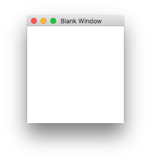
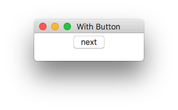
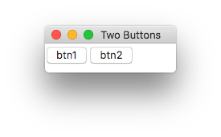
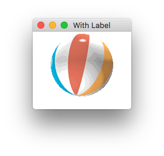
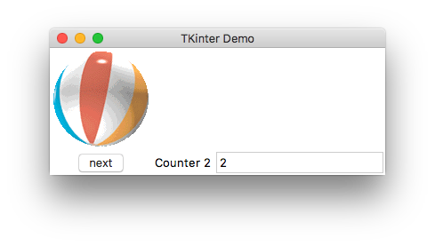

# guizero

[guizero](https://lawsie.github.io/guizero) ermöglicht die 
einfache Gestaltung von Graphischen Benutzeroberflächen.

## Installation

guizero kann mit pip installiert werden:

- Windows: pip install guizero
- Linux/Mac: pip3 install guizero

Auf der Webseite wird eine alternative Möglichkeit der Installation vorgestellt, die mit einem Download auskommt.

## Beispiele

Die folgende Beispielanwendungen zeigen verschiedene GUI-Elemente von tkinter
in Aktion. Der Quelltext muss ausgeführt werden, um das Fenster zu sehen.


```python
import guizero
```

Zunächst ein leeres Fenster ohne Inhalt.




```python
class BlankWindow:
    def __init__(self, title="Blank Window"):
        self.root = guizero.App(title=title)
        
    def run(self):
        self.root.display()
        

w = BlankWindow()
w.run()
```

## Buttons

Nun ein Fenster mit einem Button. Die Methode `click` wird bei einem Klick auf den Button ausgeführt.




```python
class WindowWithButton(BlankWindow):
    def __init__(self):
        super().__init__("With Button")
        # add button, invoking method 'click' when clicked.
        btn = guizero.PushButton(self.root, text="next", 
                                 command=self.click)
        
    def click(self):
        print("Button clicked!")

        
w = WindowWithButton()
w.run()   
```

    Button clicked!
    Button clicked!


## Layout

Zwei Buttons können in einem [Grid-Layout](https://lawsie.github.io/guizero/layout/) angeordnet werden.




```python
class WindowWithTwoButtons:
    def __init__(self):
        self.root = guizero.App(title='Two Buttons', layout='grid')
        btn1 = guizero.PushButton(self.root, text="btn1",
                                  grid=[0,0])
        btn2 = guizero.PushButton(self.root, text="btn2",
                                  grid=[1,0])
    def run(self):
        self.root.display()
        
w = WindowWithTwoButtons()
w.run()
```

## Bilder

Die Klasse `Picture` kann genutzt werden, um [Bilder anzuzeigen](https://lawsie.github.io/guizero/images/). Hierfür wird das folgende Bild `ball.gif` verwendet.





```python
class WindowWithLabel(BlankWindow):
    def __init__(self):
        super().__init__("With Label")
        # add image in a Picture-Object
        self.bild = guizero.Picture(self.root,
                                    image="ball.gif")
        
w = WindowWithLabel()
w.run()
```

## Komplexeres Beispiel

Nun ein komplexeres Beispiel mit einem Menü, einem Button und einem Label.




```python
class GUI:
    def __init__(self):
        self.counter = 0

        root = guizero.App(title='TKinter Demo', layout='grid')

        guizero.MenuBar(root,
                       toplevel=['Tools'],
                       options=[
                           [ ['Next', self.click] ]
                       ])
        # add image
        bild = guizero.Picture(root, image="ball.gif",
                              grid=[0,0])

        # add button, invoking method 'click' when clicked.
        btn = guizero.PushButton(root, text="next", 
                                 command=self.click,
                                 grid=[0,1])

        # add label with counter value
        self.lbl = guizero.Text(root, 
                                text="Label für Counter",
                                grid=[1,1])

        # add entry field
        self.ent = guizero.TextBox(root, grid=[2,1])

        # entering main event loop
        root.display()

    def click(self):
        # update label and counter
        self.lbl.value = "Counter %s" % self.counter
        self.counter += 1

if __name__ == "__main__":
    GUI()
```
