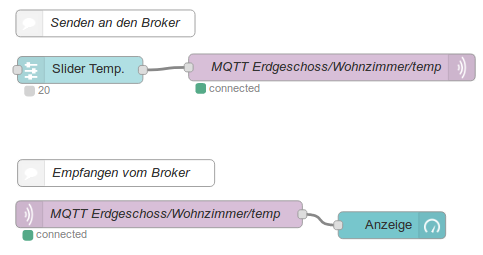
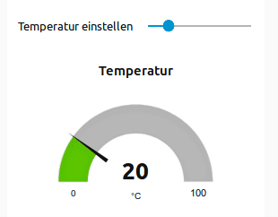

# MQTT

[MQTT](https://de.wikipedia.org/wiki/MQTT) ist ein u.a. von IBM entwickeltes offenes Protokoll, das auf Port 1883 und 8883 (mit Verschlüsselung) läuft und für die Übertragung von Sensordaten zwischen Maschinen entwickelt wurde. Ein [Artikel bei heise](https://heise.de/-2168152) und ein [Artikel bei dzone](https://dzone.com/articles/mqtt-the-nerve-system-of-iot) beschreiben das Protokoll ausführlich.

## Broker

Bei der Kommunikation ist ein Broker beteiligt, der die Nachrichten empfangen und verteilen kann. Eine Implementierung für einen solchen Broker ist "mosquitto". Er kann über den Paket-Manager installiert werden.

    sudo apt install mosquitto
    
Für Testzwecke kann auch ein öffentlicher Broker von Eclipse verwendet werden.


```python
MQTT_BROKER = "test.mosquitto.org"
MQTT_PORT = 1883
```

## Clients

Mit dem Broker können nun verschiedene Clients kommunizieren. Hierbei kann ein Client ein Topic abonnieren oder Nachrichten in ein Topic schreiben.

Ein Topic ist ähnlich einer URL oder einem Dateipfad aufgebaut und verweist z.B. auf einen Sensor an einem bestimmten Ort.


```python
TOPIC = "Ergeschoss/Wohnzimmer/Temp"
```

Als Client-Bibliothek für Python nutzen wir [paho-mqtt](https://pypi.python.org/pypi/paho-mqtt/). Diese lässt sich einfach installieren. 

- Windows: `python -m pip install paho-mqtt` oder `py -m pip install paho-mqtt`
- Linux, MacOS: `python3 -m pip install paho-mqtt`

## Subscriber

Wir beginnen mit einem Client, der ein Topic abonniert und bei neuen Nachrichten eine Ausgabe auf die Konsole macht. Hierfür geben wir zwei callback-Methoden an.

1. `my_connect_method` soll aufgerufen werden, sobald eine Verbindung zum Broker zustande gekommen ist.
2. `my_message_method` soll bei jeder neuen Nachricht aufgerufen werden.


```python
import paho.mqtt.client as mqtt

def my_connect_method(client, userdata, flags, rc):
    print("Connected. Subscribing to topic", TOPIC)
    client.subscribe(TOPIC)
    
def my_message_method(client, userdata, msg):
    print("Message received:", msg.topic, msg.payload)
```

Nun erstellen wir einen Client und legen die eben erstellten Callback-Methoden fest.


```python
client = mqtt.Client()
client.on_connect = my_connect_method
client.on_message = my_message_method
```

Schließlich verbinden wir den Client mit dem Broker und warten auf neue Nachrichten.


```python
client.connect(MQTT_BROKER, MQTT_PORT, keepalive=60)
```


    0


Wenn der Client verbunden ist, wird eine Endlosschleife gestartet, die regelmäßig neue Nachrichten abruft. Es gibt verschiedene Varianten, diese Netzwerkschleife zu starten, die [hier](https://pypi.org/project/paho-mqtt/#network-loop) genauer beschrieben werden.

- `loop_start` startet den Abruf im Hintergrund, 
- `loop_forever` startet die Netzwerkschleife im Fordergrund und blockiert damit die Anwendung ab diesem Aufruf.


```python
client.loop_start()
```

    Connected. Subscribing to topic Ergeschoss/Wohnzimmer/Temp


## Publisher

Erstellen wir nun einen weiteren Client, der in dem Topic Nachrichten veröffentlicht.


```python
publisher = mqtt.Client()
publisher.connect(MQTT_BROKER, MQTT_PORT)
publisher.loop_start()
```

Nun können wir eine Nachricht veröffentlichen. Wir sehen die Ausgabe aus unseren definierten Callback-Methoden, sobald die Nachricht eintrifft. 


```python
publisher.publish(topic=TOPIC, payload=22)
```


    <paho.mqtt.client.MQTTMessageInfo at 0x7f650f070360>


    userdata []
    userdata ['Hello', 'Hello', 'Hello', 'Hello']
    []


## User data
Sollen Daten zwischen mehreren Nachrichten ausgetauscht werden, so kann ein ``userdata``-Objekt
hierfür genutzt werden. Es wird beim Erstellen des MQTT-Clients übergeben und wird anschließend
bei jedem Eintreffen einer Nachricht automatisch mit übermittelt.


```python
USERDATA_TOPIC = "userdata_test"

def my_message(client, userdata, msg):
    userdata.append(msg.payload.decode())
    print("userdata", userdata)

# Client mit userdata-Objekt erzeugen
client = mqtt.Client(userdata=[])

client.on_message = my_message
client.connect(MQTT_BROKER)
client.subscribe(USERDATA_TOPIC)
client.loop_start()
```

Ein Publisher wird erzeugt und verbindet sich mit dem Broker


```python
publisher = mqtt.Client()
publisher.connect(MQTT_BROKER, MQTT_PORT)
publisher.loop_start()
```

Nun werden ein paar Zahlen in das Topic gesendet und dadurch die Liste in userdata
gefüllt.


```python
for i in [21,22,23]:
    publisher.publish(topic=USERDATA_TOPIC, payload=i)
```

    userdata ['21']
    userdata ['21', '22']
    userdata ['21', '22', '23']


## Dashboard

Ein Dahsboard für MQTT ermöglicht es, Werte im Broker zu visualisieren. [Node-RED](https://nodered.org/) ist eine IOT-Plattform, die mit dem Raspberry Pi ausgeliefert wird. 

### Installation

Node-Red kann um ein [Dahboard](https://flows.nodered.org/node/node-red-dashboard) erweitert werden. Hierzu wird in Node-RED im Menü "Manage Palette" > "Install" aufgerufen. In der Suchmaske kann mit `node-red-dashboard` ein solches Dashboard hinzugefügt werden.

Falls der Menüpunkt nicht vorhanden ist, kann das Modul als npm-Modul über die Kommandozeile nachinstalliert werden.

```
    $ sudo apt install npm    
    $ cd ~/.node-red
    $ npm install node-red-dashboard
```

Nach einem Neustart von Node-RED, sind zusätzliche Knoten vorhanden, mit denen ein Dashboard erstellt werden kann.

### Beispiel-Flow

Der folgende Flow zeigt oben einen Slider, der seinen Wert an einen MQTT-Broker sendet. Im unteren Bereich wird das gleiche Topic abonniert und der eingestellte Wert in einer Zeigeranzeige visualisiert.



<!--

[{"id":"4514f17c.ed104","type":"tab","label":"Flow 4","disabled":false,"info":""},{"id":"19f47891.e7549f","type":"mqtt out","z":"4514f17c.ed104","name":"MQTT Erdgeschoss/Wohnzimmer/temp","topic":"Erdgeschoss/Wohnzimmer/temp","qos":"","retain":"","broker":"aa3df211.b5b298","x":413.8833312988281,"y":101.88333129882812,"wires":[]},{"id":"15325225.39381e","type":"ui_slider","z":"4514f17c.ed104","name":"Slider Temp.","label":"Temperatur einstellen","group":"58d4c9d3.e4bee8","order":0,"width":0,"height":0,"passthru":true,"outs":"all","topic":"","min":0,"max":"100","step":1,"x":132.76666259765625,"y":104.73330688476562,"wires":[["19f47891.e7549f"]]},{"id":"9df909cb.8b6478","type":"mqtt in","z":"4514f17c.ed104","name":"MQTT Erdgeschoss/Wohnzimmer/temp","topic":"Erdgeschoss/Wohnzimmer/temp","qos":"2","broker":"aa3df211.b5b298","x":220.88333129882812,"y":265.8833312988281,"wires":[["aeadfad6.037a98"]]},{"id":"aeadfad6.037a98","type":"ui_gauge","z":"4514f17c.ed104","name":"Anzeige","group":"58d4c9d3.e4bee8","order":0,"width":0,"height":0,"gtype":"gage","title":"Temperatur","label":"°C","format":"{{value}}","min":0,"max":"100","colors":["#00b500","#e6e600","#ca3838"],"seg1":"","seg2":"","x":480.8833312988281,"y":278.1166687011719,"wires":[]},{"id":"6e4c6faf.86a82","type":"comment","z":"4514f17c.ed104","name":"Senden an den Broker","info":"Nachrcit","x":161,"y":52.75,"wires":[]},{"id":"fc2b6a3e.2ac3a","type":"comment","z":"4514f17c.ed104","name":"Empfangen vom Broker","info":"","x":172.88333129882812,"y":219.88333129882812,"wires":[]},{"id":"aa3df211.b5b298","type":"mqtt-broker","z":"","name":"eclipse","broker":"iot.eclipse.org","port":"1883","clientid":"","usetls":false,"compatmode":true,"keepalive":"60","cleansession":true,"birthTopic":"","birthQos":"0","birthPayload":"","closeTopic":"","closeQos":"0","closePayload":"","willTopic":"","willQos":"0","willPayload":""},{"id":"58d4c9d3.e4bee8","type":"ui_group","z":"","name":"Default","tab":"a485af3c.d49028","disp":true,"width":"6","collapse":false},{"id":"a485af3c.d49028","type":"ui_tab","z":"","name":"Home","icon":"dashboard"}]

-->

Eine Änderung des Schiebereglers wird nun über einen MQTT-Broker an die Zeigeranzeige weitergeleitet.



## Links

* [MQTT-Spiele](http://www.jython.ch/index.php?inhalt_links=navigation.inc.php&inhalt_mitte=mqttgames/mqttGames.inc.php)
* [traze](https://traze.iteratec.de/) ist ein Spiel, das über MQTT gespielt wird.
