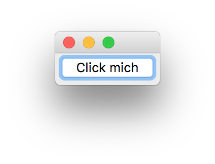
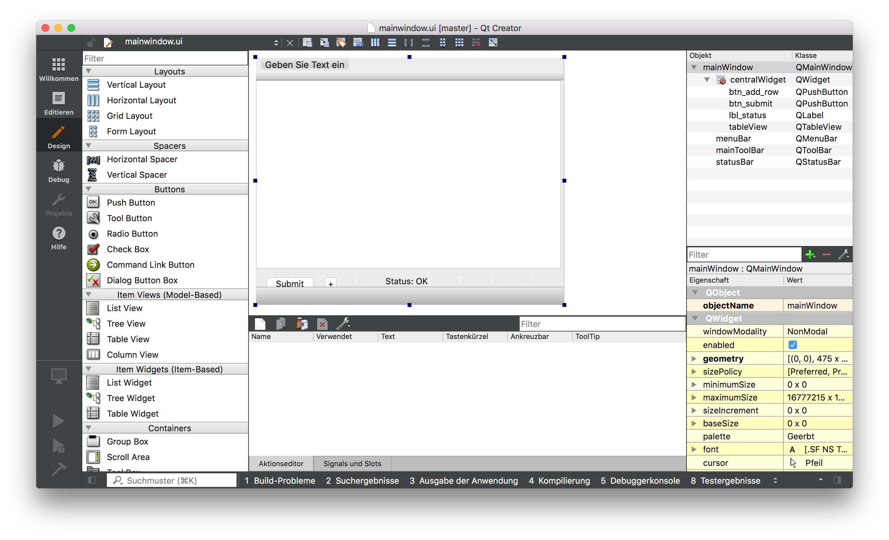
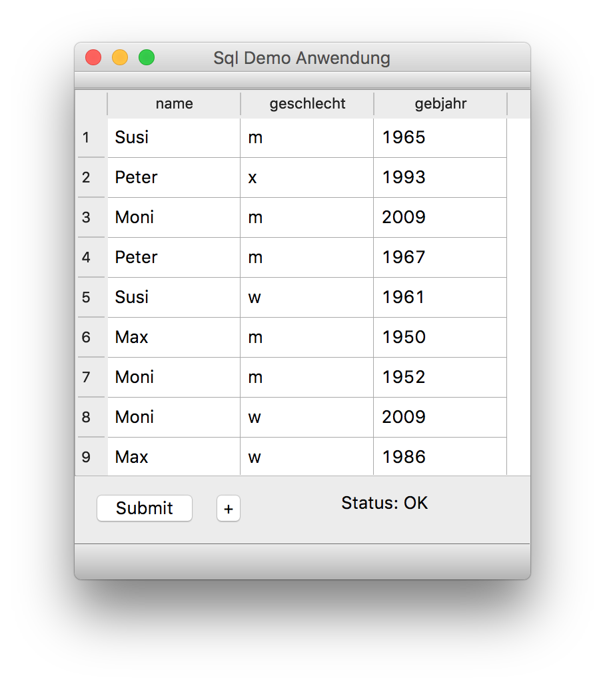

# pyqt

Qt ist eine professionelle Bibliothek für die platformübergreifende Erstellung von Anwendungen - insbesondere von Desktop-Awendungen. Mit [pyqt](https://riverbankcomputing.com/software/pyqt/intro) existiert eine Python Schnittstelle.

## Installation - Qt

Die Installation von [Qt](https://www.qt.io/) erfolgt über einen Download der Open-Source Variante der Software von der Webseite. 

## Installation - pyqt

pyqt kann über pip installiert werden.

* Windows: `pip install pyqt5` oder `python -m pip install pyqt5` oder `py -m pip install pyqt5`
* Linux, MacOS: `pip3 install pyqt5`

## Einfache Anwendung

Eine erste einfach Anwendung kann mit wenigen Zeilen Quelltext schnell erstellt werden.


```python
from PyQt5.QtWidgets import QApplication, QLabel

app = QApplication([])
label = QLabel('Hallo Welt!')
label.show()
app.exec_()
print("finished")
```

    finished


Die Klasse `QApplication` stellt die Hauptanwendung dar. Sie erhält Parameter als Übergabewert. In diesem Fall eine leere Liste, wenn es keine Parameter gibt.

## Interaktion mit einem Button

Nun soll etwas Leben ins Spiel kommen und eine Anwendung entstehen, die einen Button enthält. Damit der Button etwas tut, wenn man auf ihn drückt, müssen wir ihn mit einer Methode verknüpfen. Für die Verknüpfung von Ereignissen mit Aktionen nutzt Qt "Signals" (die Ereignisse) und "Slots" als Methoden, die auf die Ereignisse reagieren.




```python
from PyQt5.QtWidgets import QApplication, QPushButton, QMessageBox

app = QApplication([])
button = QPushButton('Click mich')

def on_button_click():
    alert = QMessageBox()
    alert.setText('Du hast den Button gefunden')
    alert.exec_()
    
button.clicked.connect(on_button_click)  # connect signal clicked with method
button.show()
app.exec_()
```


    0


## QtCreator und QtDesigner

Das Erstellen einer GUI ist in Qt besonders einfach, da ein mächtiger GUI-Editor mitgeliefert wird. Mit ihm kann die GUI erstellt und als ui-Datei (ui=user interface) gespeichert werden.

## Neues Design erstellen

Um ein neues GUI-Design erstellen zu können, wähle im Qt-Creator 

1. Neu 
1. Qt 
1. Qt-Designer-Formular



Erstelle nun zwei PushButton, einen [TableView](http://doc.qt.io/qt-5/qtableview.html#details) und ein Label mit den Namen btn_submit, btn_add_row, tableView und lbl_status. Die fertige Datei hat den Namen [mainwindow.ui](mainwindow.ui). Es handelt sich um eine XML-Datei, die von pyqt eingelesen und in Python-Quelltext umgewandelt werden kann.


```python
file mainwindow.ui
```

    mainwindow.ui: XML 1.0 document text, ASCII text


Um aus einer ui-Datei Python-Quelltext zu erzeugen, wird das Kommandozeilentool `pyuic5` mitgeliefert (uic=user interface compiler).


```python
pyuic5 -x -o mainwindow.py mainwindow.ui
```

Der Parameter `-o` bestimmt den Name der Ausgabedatei. Durch `-x` wird zusätzlich ein kleines Rahmenprogramm generiert, womit die GUI schnell angezeigt werden kann.


```python
python mainwindow.py
```

    QApplication: invalid style override passed, ignoring it.


Die generierte Datei sieht wie folgt aus.


```python
cat mainwindow.py
```

    # -*- coding: utf-8 -*-
    
    # Form implementation generated from reading ui file 'mainwindow.ui'
    #
    # Created by: PyQt5 UI code generator 5.11.3
    #
    # WARNING! All changes made in this file will be lost!
    
    from PyQt5 import QtCore, QtGui, QtWidgets
    
    class Ui_mainWindow(object):
        def setupUi(self, mainWindow):
            mainWindow.setObjectName("mainWindow")
            mainWindow.resize(475, 381)
            self.centralWidget = QtWidgets.QWidget(mainWindow)
            self.centralWidget.setObjectName("centralWidget")
            self.btn_submit = QtWidgets.QPushButton(self.centralWidget)
            self.btn_submit.setGeometry(QtCore.QRect(10, 300, 85, 27))
            self.btn_submit.setObjectName("btn_submit")
            self.tableView = QtWidgets.QTableView(self.centralWidget)
            self.tableView.setGeometry(QtCore.QRect(0, 0, 471, 291))
            self.tableView.setSortingEnabled(True)
            self.tableView.setObjectName("tableView")
            self.lbl_status = QtWidgets.QLabel(self.centralWidget)
            self.lbl_status.setGeometry(QtCore.QRect(200, 300, 251, 20))
            self.lbl_status.setObjectName("lbl_status")
            self.btn_add_row = QtWidgets.QPushButton(self.centralWidget)
            self.btn_add_row.setGeometry(QtCore.QRect(100, 300, 31, 27))
            self.btn_add_row.setObjectName("btn_add_row")
            mainWindow.setCentralWidget(self.centralWidget)
            self.menuBar = QtWidgets.QMenuBar(mainWindow)
            self.menuBar.setGeometry(QtCore.QRect(0, 0, 475, 27))
            self.menuBar.setObjectName("menuBar")
            mainWindow.setMenuBar(self.menuBar)
            self.mainToolBar = QtWidgets.QToolBar(mainWindow)
            self.mainToolBar.setObjectName("mainToolBar")
            mainWindow.addToolBar(QtCore.Qt.TopToolBarArea, self.mainToolBar)
            self.statusBar = QtWidgets.QStatusBar(mainWindow)
            self.statusBar.setObjectName("statusBar")
            mainWindow.setStatusBar(self.statusBar)
    
            self.retranslateUi(mainWindow)
            QtCore.QMetaObject.connectSlotsByName(mainWindow)
    
        def retranslateUi(self, mainWindow):
            _translate = QtCore.QCoreApplication.translate
            mainWindow.setWindowTitle(_translate("mainWindow", "Sql Demo Anwendung"))
            self.btn_submit.setText(_translate("mainWindow", "Submit"))
            self.lbl_status.setText(_translate("mainWindow", "Status: OK"))
            self.btn_add_row.setText(_translate("mainWindow", "+"))
    
    
    if __name__ == "__main__":
        import sys
        app = QtWidgets.QApplication(sys.argv)
        mainWindow = QtWidgets.QMainWindow()
        ui = Ui_mainWindow()
        ui.setupUi(mainWindow)
        mainWindow.show()
        sys.exit(app.exec_())
    


## Eine komplexere Anwendung mit Datenbank-Anbindung

Probieren wir uns nun an einer komplexeren Anwendung, die auf eine Datenbank zugreift, sie darstellt und eine Änderung der Daten ermöglicht.

## Erstellen einer Datenbank

Zunächst erstellen wir eine sqlite-Datenbank und darin eine Tabelle Person mit den Attributen id, name, geschlecht und gebjahr. Falls eine solche Datenbank schon vorhanden ist, löschen wir sie vorsorglich.


```python
rm db.sqlite
```

Wir legen ein paar Konstanten fest, die für die gesamte Anwendung gelten sollen. Der Name der Datenbank, die Anzahl der zufällig zu erzeugenden Daten, eine Auswahl von Namen, die zufällig gewählt werden und das CREATE-Statement für die Erstellung der Tabelle person.

Das CREATE enthält zusätlich einen CONSTRAINT, der für das Geschlecht nur die Werte 'w', 'm' und 'x' zulässt.


```python
DB_FILE = 'db.sqlite'
NUM_INIT_DATA = 10
NAMES = ['Peter', 'Susi', 'Moni', 'Max']
SQL_CREATE = '''
    CREATE TABLE IF NOT EXISTS person 
    (
      id integer primary key autoincrement,
      name text not null,
      geschlecht text not null,
      gebjahr integer not null,
      CONSTRAINT check_correct_val CHECK (geschlecht in ('w', 'm', 'x'))
    )
'''
```

Nun erstellen wir die Datenbank und füllen sie mit Beispieldaten.


```python
import sqlite3
import random

conn = sqlite3.connect(DB_FILE)
c = conn.cursor()
c.execute(SQL_CREATE)

for id in range(NUM_INIT_DATA):
    gebjahr = random.randint(1950, 2010)
    name = random.choice(NAMES)
    geschlecht = random.choice(['m', 'w', 'x'])

    c.execute('''INSERT INTO person (id,name,geschlecht,gebjahr) 
                 VALUES (?,?,?,?)''',
              (id, name, geschlecht, gebjahr))

conn.commit()
conn.close()
```

Mit sqlite3 können die Daten bereits auf der Kommandozeile ausgelesen werden.


```python
sqlite3 --column --header db.sqlite 'SELECT * FROM person'
```

    id          name        geschlecht  gebjahr   
    ----------  ----------  ----------  ----------
    0           Susi        m           1965      
    1           Peter       x           1993      
    2           Moni        m           2009      
    3           Peter       m           1967      
    4           Susi        w           1961      
    5           Max         m           1950      
    6           Moni        m           1952      
    7           Moni        w           2009      
    8           Max         w           1986      
    9           Max         x           1954      


Wir erstellen nun die Klasse `MainWindow`, die von der Klasse `Ui_mainWindow` erbt - letzte stammt aus der generierten Datei `mainwindow.py`. Wir ändern nichts in der generierten Datei, damit spätere Änderungen an der GUI und ein anschließendes neues Erzeugen unsere Mühen nicht kaputt machen.

Die Daten für den TableView werden aus einem [QSqlTableModel](http://doc.qt.io/qt-5/qsqltablemodel.html#details) geladen. Dieses Modell stellt Daten aus einer Datenbank zur Verfügung.


```python
import sys
import random
import sqlite3

import mainwindow
from PyQt5.QtWidgets import QApplication, QDialog, QMainWindow
from PyQt5.QtSql import QSqlTableModel, QSqlDatabase

class MainWindow(mainwindow.Ui_mainWindow):
    def __init__(self, dbfile):
        self.dbfile = dbfile
        
    def setupUi(self, mainwindow):
        super().setupUi(mainwindow)
        # connect signals with methods
        self.btn_submit.clicked.connect(self.submit_clicked)
        self.btn_add_row.clicked.connect(self.add_row_clicked)

        # create database object for sqlite-database
        db = QSqlDatabase.addDatabase('QSQLITE')
        db.setDatabaseName(self.dbfile)

        # the table model will show the data from the db in the tableview
        self.tablemodel = QSqlTableModel()
        self.tablemodel.setTable('person')
        self.tablemodel.setEditStrategy(QSqlTableModel.OnManualSubmit)
        self.tablemodel.select()  # populate model with data

        self.tableView.setModel(self.tablemodel)
        self.tableView.hideColumn(0)  # hide ids

    def submit_clicked(self):
        'Write changes into the DB when submit button is clicked.'
        succ = self.tablemodel.submitAll()
        self.lbl_status.setText("Daten erfolgreich gespeichert? %s" % succ)

    def add_row_clicked(self):
        'Add new row to the table when +-Button is clicked.'
        self.tablemodel.insertRows(self.tablemodel.rowCount(), 1)
```

Schließlich erzeugen wir eine neue Instanz der Klasse und starten das Programm.




```python
app = QApplication([])
window = QMainWindow()
ui = MainWindow(DB_FILE)
ui.setupUi(window)
window.show()

app.exec_()
```
