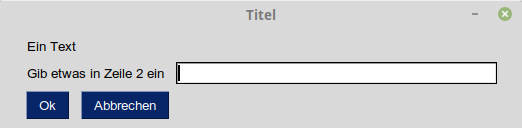
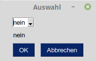

# PySimpleGUI

Hinter dem GUI-Framework [PySimpleGui](https://github.com/PySimpleGUI/PySimpleGUI) 
verbirgt sich ein Pythonpaket, mit dem grafische
Oberflächen für Pythonprogramme einfach erstellt werden können.

## Installation

Die Installation erfolgt einfach mit Hilfe von pip:

    pip install pysimplegui  # oder
    py -m pip install pysimplegui

## Verwendung

Nun kann das Paket importiert werden.


```python
import PySimpleGUI as sg
```

Das Layout innerhalb eines Fensters wird mit Hilfe von Listen erstellt.
Eigentlich sind es Listen aus Listen. Jede dieser Listen entspricht einer
Zeile in der Oberfläche.

Zuerst soll eine Anwendung mit
Textfeldern, einem Eingabefeld und zwei Buttons erstellt werden.




```python
layout = [ [sg.Text('Ein Text')],
           [sg.Text('Gib etwas in Zeile 2 ein'), sg.InputText()],
           [sg.Button('Ok'), sg.Button('Abbrechen')] ]
```

Dieses Layout wird bei der Erstellung eines Window-Objektes genutzt. Der erste Parameter gibt den 
Fenstertitel, der zweite das Layout an.


```python
window = sg.Window('Titel', layout)
```

In einer Schleife wird das Programm nun durchlaufen. In jeder Iteration fragt die Schleife
über die Methode `read` die Events ab, die von einem Button ausgelöst wurden. Es wird der
Name des Buttons sowie ein Dictionary zurückgeliefert. In dem Dictionary sind die Einträge
der Eingabefelder gespeichert.


```python
while True:
    event, values = window.read()
    if event in (None, 'Abbrechen'):
        break

    print('You entered', values[0])

window.close()
```

In den [Tutorials der Anleitung](https://pysimplegui.readthedocs.io/en/latest/cookbook/)
sind weitere Möglichkeiten beschrieben, einfach und schnell
Anwendungen mit Fenstern zu erstellen.

## DropDown-Felder



Eingaben können nicht nur mit Textfeldern, sondern z.B. auch mit DropDown-Feldern
erfolgen. Dies geschiet mit der Klasse `DropDown`. Bei der Erstellung werden die 
verschiedenen Optionen als Liste im Konstruktor übergeben.


```python
sg.DropDown(['ja', 'nein'])
```

Wir erstellen nun ein neues Layout und binden das DropDown-Feld dort ein.

In dem neuen Layout erhalten das DropDown- und das Textfeld über das Attribut `key` einen Namen:
`AUSWAHL` und `TEXTFELD`.
Die einzelnen GUI-Komponenten werden unter diesem Namen im Window-Objekt abgelegt und die
Ergebnisse lassen sich unter diesem Namen im values-Dictionary abrufen.


```python
layout = [ [sg.DropDown(['ja', 'nein'], key='AUSWAHL')], 
           [sg.Text('     ', key='TEXTFELD')],
           [sg.Button('OK'), sg.Button('Abbrechen')]]
```


```python
window = sg.Window('Auswahl', layout)
```

Die Komponenten des Objektes `window` lassen sich nun mit eckigen Klammern abrufen und ihr Wert mit der Methode
`Update` aktualisieren.


```python
while True:
    event, values = window.Read()
    if event in (None, 'Abbrechen'):
        break
        
    auswahl = values['AUSWAHL']
    window['TEXTFELD'].Update(auswahl)

window.close()
```

## Links

* [PySimpleGuiWeb](https://github.com/PySimpleGUI/PySimpleGUI/tree/master/PySimpleGUIWeb) ermöglicht das Erstellen von Web-Anwendungen mit PySimpleGui.
